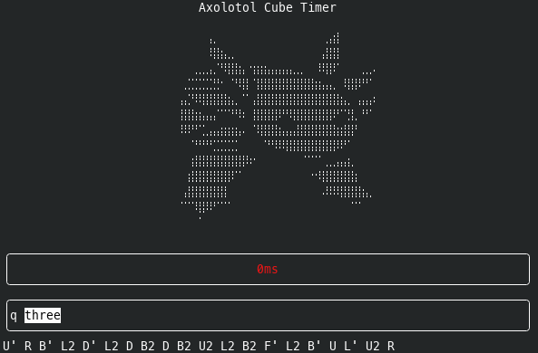

# axolotl-cube-timer

CLI Speedcubing timer built with C++/FTXUI



## Dependencies

- [tnoodle-cli](https://github.com/SpeedcuberOSS/tnoodle-cli) for WCA-compliant scrambles generation

## Installation

At the moment you can only build `axolotl-cube-timer` from sources.

Installation dependencies:
1. `conan2`
2. `cmake>=3.16`

1. Download source code repository:
```bash
git clone https://github.com/dj1vs/axolotl-cube-timer
cd axolotl-cube-timer
```
2. Install packages from conan:
```bash
sh/conan_install.sh
```
3. Build project:
```bash
sh/conan_build.sh
```
4. Your executable will be generated in `build` folder.

## Usage

For `axolotl-cube-timer` you can use the following shortcuts:

- `n` - generate new scramble
- `Space` - start/end timer
- `q` - quit

Managing current puzzle via dropbox is intuitive.